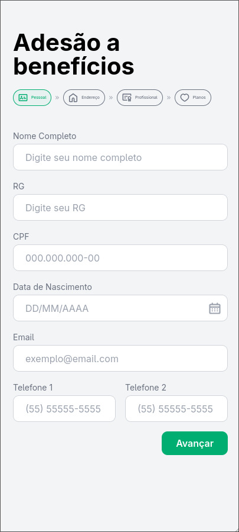

<div align="center">

# 📄 AMPARE - Sistema de Adesão a Benefícios

**Sistema completo para geração e envio de contratos de adesão a benefícios com formulário multi-step e assinatura digital**

[](https://reactjs.org/)
[](https://vitejs.dev/)
[](https://tailwindcss.com/)
[](https://nodejs.org/)
[](https://pdf-lib.js.org/)

</div>

---

## 📸 Preview

<div align="center">

### 🖥️ Desktop


### 📱 Mobile


*Interface responsiva com design moderno e intuitivo*

</div>

---

## ✨ Funcionalidades

### 🎯 Principais Características

- **📝 Formulário Multi-Step** - Interface intuitiva dividida em 4 etapas (Pessoal, Endereço, Profissional, Planos)
- **✍️ Assinatura Digital** - Canvas interativo para captura de assinatura com mouse ou touch
- **📋 Validação Inteligente** - Validação em tempo real de CPF, email, telefone e outros campos
- **🏠 Busca Automática de CEP** - Integração com ViaCEP para preenchimento automático de endereço
- **👨‍👩‍👧‍👦 Gestão de Dependentes** - Sistema para adicionar até 6 dependentes (plano Vitalmed)
- **📄 Geração de PDFs** - Criação automática de contratos preenchidos com dados do formulário
- **📧 Envio por Email** - Envio automático dos contratos para administradores
- **🎨 Design Responsivo** - Interface adaptável para desktop, tablet e mobile
- **⚡ Performance Otimizada** - Carregamento rápido com Vite e otimizações de build
- **🔄 Sistema de Retry** - Tentativas automáticas em caso de falha na comunicação com servidor

### 🛠️ Funcionalidades Técnicas

- **🏗️ Arquitetura Modular** - Código organizado com hooks personalizados e utilitários reutilizáveis
- **🔧 Hooks Personalizados** - useFormValidation, useAlert, useServerWakeup, useFormSubmission
- **📦 Build Single File** - Geração de arquivo único para deploy simplificado
- **🛡️ Validação Robusta** - Sistema completo de validação com JSDoc e PropTypes
- **🎭 Animações Fluidas** - Transições suaves com Framer Motion
- **📱 PWA Ready** - Estrutura preparada para Progressive Web App
- **🔒 CORS Configurado** - Segurança adequada para produção
- **📊 Logs Detalhados** - Sistema de logging para monitoramento
- **🗂️ Gestão de Arquivos** - Limpeza automática de arquivos temporários
- **⚙️ Configuração Flexível** - Variáveis de ambiente para diferentes ambientes

---

## 🏗️ Arquitetura do Projeto

```
PDF-From/
├── 📁 src/                    # Código fonte do frontend
│   ├── 📁 components/         # Componentes React
│   │   ├── 📁 steps/          # Componentes dos steps do formulário
│   │   ├── 📁 icons/          # Ícones SVG customizados
│   │   ├── CustomAlert.jsx    # Componente de alertas
│   │   ├── SignatureCanvas.jsx # Canvas de assinatura
│   │   └── SuccessMessage.jsx  # Mensagem de sucesso
│   ├── 📁 hooks/              # Hooks personalizados
│   │   ├── useAlert.js        # Gerenciamento de alertas
│   │   ├── useFormValidation.js # Validação de formulários
│   │   ├── useFormSubmission.js # Submissão com retry
│   │   └── useServerWakeup.js # Wakeup do servidor
│   ├── 📁 utils/              # Utilitários
│   │   ├── validation.js      # Funções de validação
│   │   ├── dateUtils.js       # Utilitários de data
│   │   ├── formUtils.js       # Utilitários de formulário
│   │   └── pdfUtils.js        # Utilitários de PDF
│   ├── 📁 constants/          # Constantes
│   │   ├── api.js             # Configurações da API
│   │   └── fieldNames.js      # Nomes de campos
│   ├── App.jsx                # Componente principal
│   ├── main.jsx               # Entry point
│   └── index.css              # Estilos globais
├── 📁 backend/                # Servidor Node.js
│   ├── 📁 public/             # PDFs templates
│   ├── server.js              # Servidor Express
│   └── package.json           # Dependências do backend
├── 📁 public/                 # Assets estáticos
├── index.html                 # HTML principal
├── vite.config.mjs            # Configuração do Vite
├── tailwind.config.cjs        # Configuração do Tailwind
└── package.json               # Dependências do frontend
```

---

## 📄 Páginas e Seções

### 🏠 **Página Principal**
- Interface de formulário multi-step
- Navegação entre etapas com indicadores visuais
- Validação em tempo real
- Sistema de alertas personalizados

### 👤 **Step 1 - Dados Pessoais**
- Campos: Nome, RG, CPF, Data de Nascimento, Email, Telefones
- Validação de CPF com algoritmo completo
- Calendário nativo para seleção de data
- Formatação automática de campos

### 🏠 **Step 2 - Endereço**
- Campos: CEP, Rua, Número, Complemento, Bairro, Cidade, Estado
- Busca automática de CEP via ViaCEP
- Preenchimento automático de endereço
- Validação de campos obrigatórios

### 💼 **Step 3 - Dados Profissionais**
- Campos: Empresa, Matrícula, Órgão, Cargo, PIS, Data de Admissão
- Campos opcionais para funcionários públicos
- Validação de PIS e matrícula
- Calendário para data de admissão

### 📋 **Step 4 - Planos e Assinatura**
- Seleção de planos: Qualidonto, Vitalmed, Blue Saúde
- Gestão de dependentes (até 6 para Vitalmed)
- Canvas de assinatura digital
- Validação final antes do envio

### ✅ **Página de Sucesso**
- Confirmação de envio
- Informações de contato
- Opção de nova solicitação

---

## 🛠️ Tecnologias Utilizadas

### **Frontend**
- **React 18.2.0** - Biblioteca para interfaces de usuário
- **Vite 5.4.18** - Build tool moderna e rápida
- **Tailwind CSS 3.4.1** - Framework CSS utilitário
- **Framer Motion 12.10.4** - Biblioteca de animações
- **Cleave.js 1.6.0** - Formatação de inputs
- **Signature Pad 4.2.0** - Canvas para assinatura digital

### **Backend**
- **Node.js** - Runtime JavaScript
- **Express 4.21.2** - Framework web
- **PDF-lib 1.17.1** - Manipulação de PDFs
- **Nodemailer 6.10.1** - Envio de emails
- **Multer 1.4.5** - Upload de arquivos
- **CORS 2.8.5** - Configuração de CORS

### **Ferramentas de Desenvolvimento**
- **@vitejs/plugin-react 4.0.0** - Plugin React para Vite
- **Autoprefixer 10.4.16** - Prefixos CSS automáticos
- **PostCSS 8.4.33** - Processador CSS
- **vite-plugin-singlefile 2.2.0** - Plugin para build single file

### **Integrações**
- **ViaCEP API** - Busca de endereços por CEP
- **SMTP AMPARE** - Servidor de email corporativo
- **PDF Templates** - Contratos pré-formatados

---

## 🚀 Como Executar

### **Pré-requisitos**
- Node.js 16+ 
- npm ou yarn
- Git

### **Instalação**

```bash
# 1. Clone o repositório
git clone https://github.com/seu-usuario/ampare-contracts.git
cd ampare-contracts

# 2. Instale dependências do frontend
npm install

# 3. Instale dependências do backend
cd backend
npm install
cd ..

# 4. Configure variáveis de ambiente
cp backend/.env.example backend/.env
# Edite o arquivo .env com suas configurações

# 5. Execute o backend
cd backend
npm run dev

# 6. Execute o frontend (em outro terminal)
npm run dev
```

### **Scripts Disponíveis**

```bash
# Frontend
npm run dev      # Servidor de desenvolvimento
npm run build    # Build para produção
npm run preview  # Preview do build

# Backend
npm run start    # Servidor de produção
npm run dev      # Servidor de desenvolvimento com nodemon
```

---

## 🔧 Configuração

### **Variáveis de Ambiente**

```env
# Backend (.env)
PORT=3000
SMTP_USER=seu-email@email.com
SMTP_PASSWORD=sua-senha
ADMIN_EMAIL=admin@email.com

# Frontend (opcional)
VITE_API_URL=https://link.com
```

### **Personalização**

#### **Cores e Tema**
```javascript
// tailwind.config.cjs
module.exports = {
  theme: {
    extend: {
      colors: {
        primary: '#00AE71',
        secondary: '#F8F9FA',
      },
    },
  },
};
```

#### **Validações**
```javascript
// src/utils/validation.js
export const validateCPF = (value) => {
  // Algoritmo de validação personalizado
};
```

#### **Templates de PDF**
```javascript
// backend/server.js
export const CONTRACT_FILES = {
  saude: {
    label: 'Seguro-Saúde',
    file: path.join(__dirname, 'public', 'contrato-blue-saude.pdf'),
    positions: { /* coordenadas dos campos */ }
  },
  // ... outros contratos
};
```

---

## 📱 Responsividade

### **Breakpoints Suportados**
- **📱 Mobile** - 320px - 768px
- **📱 Tablet** - 768px - 1024px  
- **🖥️ Desktop** - 1024px - 1440px
- **🖥️ Large Desktop** - 1440px+

### **Adaptações por Dispositivo**
- **Mobile**: Layout em coluna única, navegação simplificada
- **Tablet**: Layout híbrido, formulário otimizado para touch
- **Desktop**: Layout em duas colunas, imagem lateral
- **Large Desktop**: Layout expandido com espaçamentos otimizados

---

## 📄 Licença

Este projeto está licenciado sob a **Licença MIT**.

### **Permissões**
- ✅ Uso comercial
- ✅ Modificação
- ✅ Distribuição
- ✅ Uso privado

### **Restrições**
- ❌ Sem garantia
- ❌ Sem responsabilidade

### **Consequências de Violação**
- Revogação automática da licença
- Ação legal por violação de direitos autorais
- Danos e prejuízos conforme legislação aplicável

**Para mais detalhes, consulte o arquivo [LICENSE](LICENSE).**

---

## 📞 Contato

### **Desenvolvedor**
- **Nome**: Equipe AMPARE
- **Email**: dev@ampare.org.br
- **Website**: [ampare.org.br](https://ampare.org.br)

### **Links Úteis**
- **Portfolio**: [ampare.org.br](https://ampare.org.br)
- **GitHub**: [github.com/ampare](https://github.com/ampare)
- **LinkedIn**: [linkedin.com/company/ampare](https://linkedin.com/company/ampare)

### **Suporte**
- **Email**: suporte@ampare.org.br
- **Telefone**: (11) 99999-9999
- **Horário**: Segunda a Sexta, 8h às 18h

---

<div align="center">

**Feito com ❤️ e ☕ por Equipe AMPARE**

⭐ Se este projeto foi útil para você, considere dar uma estrela no repositório!

</div>
