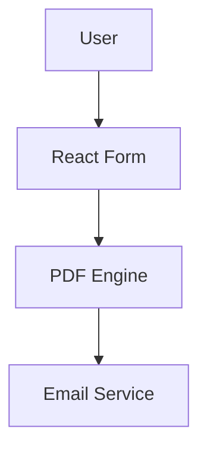

<div align="center">

# AMPARE CONTRACTS
### DOCUMENT GENERATOR


<br />

**Sistema para criação de contratos através de formulário online.**
**Gera automaticamente PDF com assinatura digital.**

[Getting Started](#-getting-started) • [License](#-license)

</div>

---

## 🏗️ Architecture

Web application for capturing user input and generating legal PDF documents.



---

## 🚀 Features

<div align="center">

| Feature | Description |
|:-------:|:----------- |
| **Dynamic Forms** | Multi-step form for data collection. |
| **PDF Generation** | Automatic creation of signed contracts. |
| **Email Delivery** | Sends contract to client and admin. |

</div>

---

## 🛠️ Getting Started

### Prerequisites

*   **Node.js 18+**

### Installation

```bash
# Private Repository
# Contact owner for access
```

---

## 📄 License

This project is proprietary and confidential.

**Copyright © 2026 Dionatha Goulart.**
All Rights Reserved.
